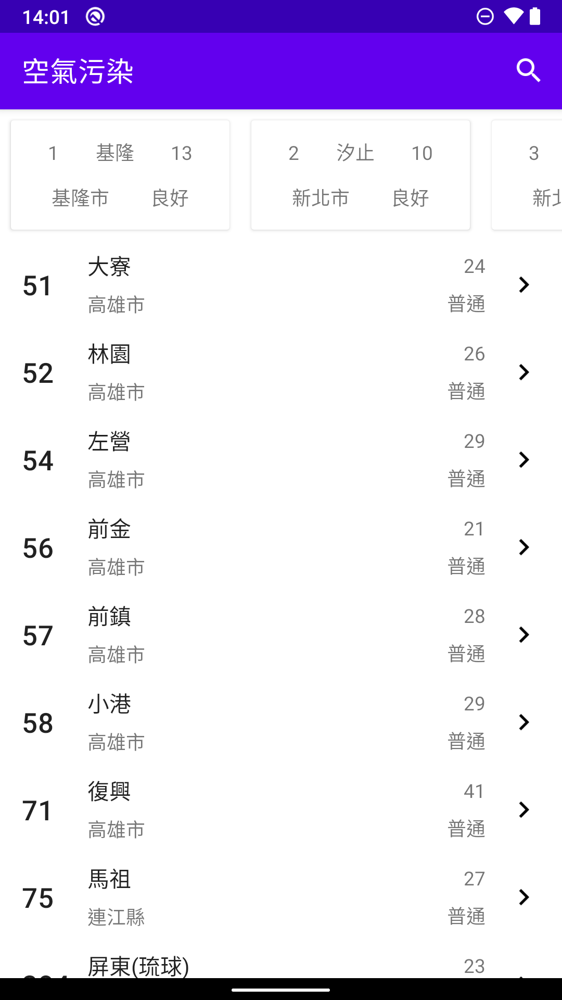
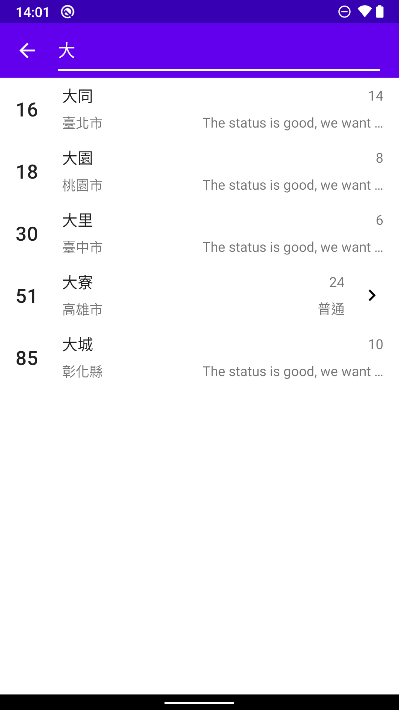

# 串接政府公開 API，呈現空污資料

- threshold 設定為 20 資料會分布的比較平均。

# Data
- Fetch with Retrofit and Gson converter
- 資料會在 MainViewModel init 時抓取一次，保存在 in-memory 的 DB 內
- 透過 room 的協助產生 LiveData 建立 observer pattern

# UI
## MainFragment
- 透過 Concat Adapter 將上下兩種相接。上方在 ViewHolder 內再建立一 RecyclerView 放置橫向 items
- records 由 DB 取出後透過 switchMap 方法轉為上下各自需要的 data list
- Layout 的需求透過 Constraint Layout 的特性達成
## SearchFragment
- 用 EditText 的 onTextChange 監聽輸入資料，透過 switchMap 來處理字串的比對，並替換 sql query 取得 LiveData。當 input 改變時也立刻改變結果。

